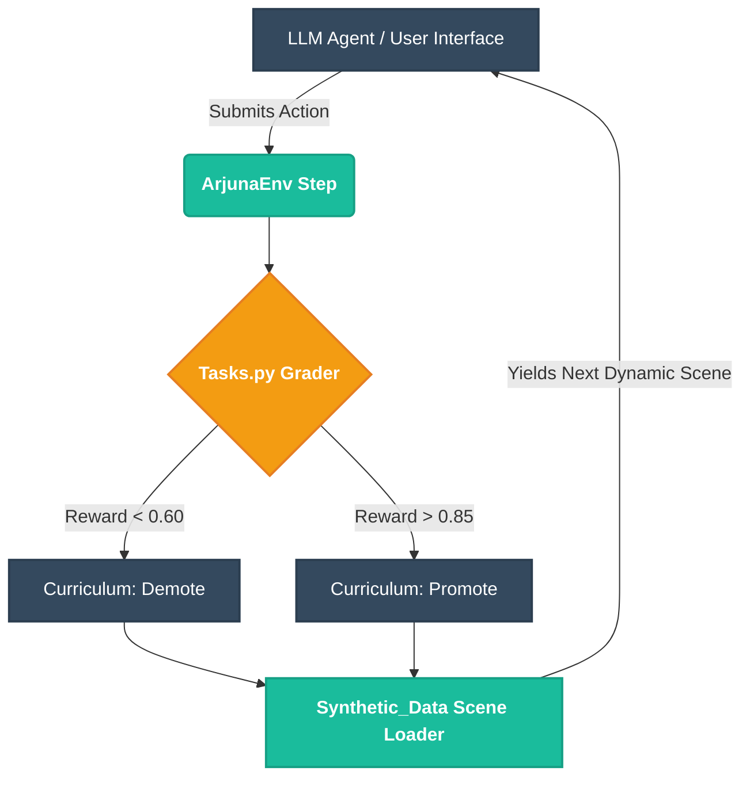

# ARJUNA: Dynamic Auto-Curriculum for Robust Perception
### An OpenEnv-Compliant Framework for Generalizable Reinforcement Learning

**ARJUNA** (`arjuna-perception-env`) is a simulated robot perception testbed designed to solve the **Generalization Gap** in RL. By integrating a **Rule-Based Auto-Curriculum** with **Dense Sequence Alignment Rewards**, it forces agents to master **Out-of-Distribution (OOD)** scenarios—from clean urban streets to chaotic, low-visibility edge cases—without manual tuning.

## What does this environment do?

ARJUNA is an autonomous robot whose “eyes” are simulated here. Each **episode** is a **3-step sequence** (identify → triage → decide) over one **themed bundle** of scenes (see `EPISODE_BUNDLES` in `server/synthetic_data.py`). The agent receives **natural-language observations** with fake detections and must emit a structured **action** per step. The **grader** returns a **per-step reward in \[0, 1\]**, and after step 3 an **`overall_reward`** (mean of the three steps) plus **feedback**—without real cameras, cloud databases, or (for the env itself) any external API.

---

## Quick Start — No API Key Required

The environment runs **fully offline**. 
No API key needed to run the environment itself.

### Run with Docker (recommended)
```bash
docker build -t arjuna-env .
docker run -p 7860:7860 arjuna-env
```

### Run locally
```bash
pip install -r requirements.txt
python -m uvicorn server.app:app --host 0.0.0.0 --port 7860
```

### Test offline with demo.py
```bash
# No API key needed — uses heuristic policy
python demo.py
```

---

## Core vs Optional Features

### Core (offline, no API key needed)
| Feature | File | Description |
|---|---|---|
| Environment server | server/app.py | HTTP endpoints |
| Episode logic | server/arjuna_environment.py | reset/step/state |
| Task graders | server/tasks.py, server/grader.py | reward logic |
| Synthetic scenes | server/synthetic_data.py | **14 offline episode bundles** |
| Data models | models.py | typed actions/observations |
| Offline demo | demo.py | heuristic agent, no LLM |

### Optional (requires API key + network)
| Feature | File | How to enable |
|---|---|---|
| LLM baseline agent | inference.py | Set API_BASE_URL + HF_TOKEN |
| Dynamic scene generation | server/scene_generator.py | ENABLE_DYNAMIC_SCENES=true |
| Auto-curriculum | server/curriculum.py | ENABLE_DYNAMIC_SCENES=true |
| AutoRL loop | autorl.py | Set API_BASE_URL + HF_TOKEN |

The environment **always falls back to synthetic_data.py** 
if dynamic scene generation is disabled or fails.

---

## Offline Execution Guarantee

All of these work with **zero network calls**:
- `POST /reset` → picks from synthetic_data.py bundles
- `POST /step` → grades using local tasks.py logic
- `GET /state` → returns local session state
- `GET /health` → returns healthy
- `GET /schema` → returns typed schemas
- `GET /metadata` → returns environment info
- `python demo.py` → full 3-step episode, heuristic policy

---

## Episode Bundles — 14 Offline Scenarios

All 14 bundles are hardcoded in `server/synthetic_data.py` and require **zero network calls**.
Each bundle contains 3 scenes — one per task step — drawn from the same location theme.

| # | Bundle | Task 1 Object | Task 2 Objects | Task 3 Confidence | Expected Action |
|---|---|---|---|---|---|
| 1 | **Urban Street** | person | car, bicycle, person, traffic light | 0.24 | discard |
| 2 | **Warehouse** | forklift | worker, truck, forklift, carton | 0.42 | request_rescan |
| 3 | **Parking Lot** | car | car, person, parking meter, CCTV camera | 0.31 | discard |
| 4 | **School Zone** | bus | student, bicycle, backpack, bus | 0.38 | request_rescan |
| 5 | **Airport** | airplane | airplane, suitcase, boarding gate, trolley | 0.19 | discard |
| 6 | **Hospital Entrance** | ambulance | person, ambulance, wheelchair, stretcher | 0.51 | log_and_continue |
| 7 | **Construction Site** | helmet | worker, excavator, crane, helmet | 0.44 | request_rescan |
| 8 | **Night Street** | streetlight | motorcycle, person, fire hydrant, streetlight | 0.21 | discard |
| 9 | **Forest Trail** | hiker | hiker, dog, backpack, tree | 0.28 | discard |
| 10 | **Shopping Mall** | shopping bag | person, escalator, shopping bag, CCTV camera | 0.46 | request_rescan |
| 11 | **Office Lobby** | laptop | person, couch, reception desk, potted plant | 0.54 | log_and_continue |
| 12 | **Rainy Street** | raincoat | bus, car, person, umbrella | 0.38 | request_rescan |
| 13 | **Blizzard Whiteout** | truck | person, car, stop sign | 0.22 | discard |
| 14 | **Sensor Glare** | motorcycle | ambulance, person, traffic light | 0.46 | request_rescan |

> **Task 3 Decision Bands:**
> - `confidence < 0.35` → `discard`
> - `0.35 ≤ confidence < 0.50` → `request_rescan`
> - `confidence ≥ 0.50` → `log_and_continue`

## Dense Reward Mechanism (Sequence Alignment)

Unlike basic sparse-reward environments (where an agent receives a binary `1.0` or `0.0`), ARJUNA uses **Dense Rewards** powered by Levenshtein Edit Distance (`SequenceMatcher`).
* **Differentiable Feedback:** When an agent attempts the Multi-Object Triage task, sequence alignment provides a granular gradient of success (e.g. `0.50`, `0.83`, `1.00`).
* **Accelerated Convergence:** Enabling the agent to learn from partial successes and severely penalizing verbosity (extra hallucinated objects) significantly accelerates RL convergence and mirrors modern Reward Model (RM) techniques.

---

## Zero-Shot Baseline & Environment Audit Logging

To prove that the ARJUNA environment accurately evaluates edge cases without requiring a days-long backpropagation training loop, this repository includes a **Zero-Shot Baseline Agent** (`inference.py`).
* **Baseline Validation:** We use an un-tuned LLM (Llama-3/Groq) to blindly attempt the environment. The LLM naturally gets "stuck" in the Medium difficulty tier because the environment rigorously enforces triage tie-breakers—confirming that higher tiers require policy-gradient optimization or fine-tuning beyond zero-shot capabilities.
* **Audit Trail Logger:** The environment outputs a standardized `inference_audit_log.csv` of all interactions. This allows researchers to analyze agent failure points (incorrect sequence alignments, failed confidence thresholds) and evaluate the distribution of Dense Rewards over an RL training session.

**Sample Audit Log Output (Active transition into the Hard Tier):**
```csv
Timestamp,Episode_ID,Task_Type,Bundle,Agent_Action,Reward
2026-04-08 05:38:09,5c89a...,Task 3,Hospital Entrance,"{""decision"":""log_and_continue""}",1.000
2026-04-08 05:38:12,21bba...,Task 2,Parking Lot,"{""ranked"":[""person"",""car"",""meter""]}",0.650
2026-04-08 05:38:29,f7893...,Task 2,Rainy Street,"{""ranked"":[""bus"",""car"",""person"",""umbrella""]}",1.000
```

---

## Table of contents

1. [Hackathon / Round 1: quick answers](#hackathon--round-1-quick-answers)  
2. [Why 3-step episodes?](#why-3-step-episodes)  
3. [**AutoRL approach — how it all fits together**](#autorl-approach--how-it-all-fits-together)  
4. [Dynamic Scene Generation (Level 1)](#dynamic-scene-generation-level-1)  
5. [Auto-Curriculum Learning (Level 2)](#auto-curriculum-learning-level-2)  
6. [Environment overview (observations, actions, tasks)](#environment-overview-observations-actions-tasks)  
7. [Prerequisites](#prerequisites)  
8. [Setup: `requirements.txt` and venv](#setup-requirementstxt-and-venv)  
9. [Run with Docker](#run-with-docker)  
10. [Run locally without Docker (uvicorn)](#run-locally-without-docker-uvicorn)  
11. [Run the demo (offline)](#run-the-demo-offline)  
12. [Gradio Playground (`/web`)](#gradio-playground-web)  
13. [How grading works](#how-grading-works)  
14. [OpenEnv compliance and key files](#openenv-compliance-and-key-files)  
15. [Project structure](#project-structure)  
16. [Example interaction (reset → three steps)](#example-interaction-reset--three-steps)  
17. [Testing and validation](#testing-and-validation)  
18. [Offline execution](#offline-execution)  
19. [Optional: LLM baseline (`inference.py`)](#optional-llm-baseline-inferencepy)  
20. [Design notes](#design-notes)  
21. [Troubleshooting](#troubleshooting)  
22. [FAQ](#faq)  
23. [Future improvements](#future-improvements)  
24. [Visuals & architecture](#visuals--architecture)  
25. [Credits and acknowledgements](#credits-and-acknowledgements)  
26. [License](#license)  
27. [Maintainer / contact](#maintainer--contact)  

---

## Why 3-step episodes?

A **single-step** environment gives RL agents one reward signal per reset — limiting the training signal and making it impossible to model sequential decision-making. ARJUNA solves this with **3-step episodes**:

| Benefit | Detail |
|---------|--------|
| **Denser reward signal** | Agents receive a reward after **every step** (not just at episode end), enabling faster credit assignment and learning. |
| **Sequential difficulty** | Steps escalate: easy identification → ordered triage → ambiguous low-confidence call. Agents must adapt within the same episode. |
| **Thematic coherence** | All 3 steps draw scenes from the same **location bundle** (e.g. "Warehouse"), so context carries across steps — closer to real-world perception pipelines. |
| **Overall episode signal** | `overall_reward` = mean of 3 step rewards gives a clean episode-level metric for leaderboard comparison. |

The **14 themed bundles** ensure diverse training distributions across resets:

| # | Bundle | Notable Objects |
|---|---|---|
| 1 | **Urban Street** | person, car, bicycle, traffic light |
| 2 | **Warehouse** | truck, forklift, carton, worker |
| 3 | **Parking Lot** | car, parking meter, CCTV camera, person |
| 4 | **School Zone** | bus, backpack, bicycle, student |
| 5 | **Airport** | airplane, suitcase, boarding gate, trolley |
| 6 | **Hospital Entrance** | ambulance, wheelchair, stretcher, person |
| 7 | **Construction Site** | helmet, excavator, crane, worker |
| 8 | **Night Street** | streetlight, fire hydrant, person, motorcycle |
| 9 | **Forest Trail** | hiker, backpack, tree, dog |
| 10 | **Shopping Mall** | person, escalator, shopping bag, CCTV camera |
| 11 | **Office Lobby** | laptop, reception desk, couch, potted plant |
| 12 | **Rainy Street** | umbrella, car, bus, raincoat |
| 13 | **Blizzard Whiteout** | truck, person, car, stop sign |
| 14 | **Sensor Glare** | motorcycle, ambulance, person, traffic light |

---

## AutoRL approach — how it all fits together

ARJUNA implements a **closed-loop, self-improving training environment** inspired by Automatic Reinforcement Learning (AutoRL) principles. The two subsystems — **Dynamic Scene Generation** and **Auto-Curriculum** — work together in a feedback loop:

### Auto-Curriculum Architecture



### Key design principles

| Principle | Implementation |
|-----------|----------------|
| **No memorization** | The LLM generates a **unique scene every `reset()`** — ensures Out-of-Distribution (OOD) robustness by preventing catastrophic overfitting to static datasets |
| **Adaptive difficulty** | A sliding-window curriculum automatically **promotes/demotes** difficulty based on recent performance |
| **Graceful degradation** | If the LLM is unavailable, the environment **falls back** to **12 hardcoded offline episode bundles** — it always works offline |
| **Stateless scalability** | The `episode_id` + `SESSIONS` pattern lets the autoRL loop run across **stateless HTTP workers** (e.g., HF Spaces) |
| **Environment variables** | `ENABLE_DYNAMIC_SCENES`, `API_BASE_URL`, `HF_TOKEN` toggle the full autoRL loop on/off without code changes |

### Files implementing autoRL

| File | Role in AutoRL |
|------|----------------|
| `server/scene_generator.py` | LLM-powered scene generation with difficulty-aware prompts (easy/medium/hard) |
| `server/curriculum.py` | `AutoCurriculum` class: sliding-window reward tracker with promote/demote logic |
| `server/arjuna_environment.py` | Orchestrator: calls `generate_episode_bundle()` on `reset()`, calls `record_episode()` after final `step()` |
| `server/app.py` | Exposes `GET /curriculum` endpoint for real-time monitoring |

---

## Environment overview (observations, actions, tasks)

### What the agent sees

After **`reset`**, **`ArjunaObservation`** includes:

- **`task_type`**: `1` for step 1 (then `2`, then `3` after each graded step)
- **`step_number`**: `1`, `2`, or `3` — which step you are on
- **`bundle_name`**: human-readable theme (e.g. “Urban Street”) shared across the episode
- **`scene_id`**: id for the **current** task’s scene (e.g. `t1_bnd_urban`)
- **`observation_text`**: instructions + scene description + simulated YOLO lines
- **`episode_id`**: must be sent back on **stateless HTTP** `POST /step` (see below)
- After each **`step`**: **`reward`** for that step, **`done`** (false until step 3), **`feedback`**
- After the **third** **`step`**: **`overall_reward`** (mean of the three step rewards), **`done: true`**

Definitions live in **`models.py`**.

### What actions it can take

Single Pydantic model **`ArjunaAction`** — set fields that match the active **`task_type`**:

| Field | Task | Role |
|--------|------|------|
| **`task1_label`** | 1 | Predicted class label (string) |
| **`ranked_objects`** | 2 | Ordered list of labels (most important first) |
| **`decision`** | 3 | One of `discard`, `request_rescan`, `log_and_continue` |
| **`reasoning`** | 3 | Optional; affects partial credit on task 3 |

### The three tasks (summary)

- **Task 1 — Single-object identification:** One primary detection; agent fills **`task1_label`**. Grading uses **exact match** plus **semantic partial credit** (same broad category, etc.). See [How grading works](#how-grading-works).
- **Task 2 — Multi-object triage:** Several detections; agent fills **`ranked_objects`**. Score is **fraction of positions matching** the ground-truth order (confidence first; tie-break: person > vehicle > other).
- **Task 3 — Low-confidence decision:** One low-confidence primary detection; agent fills **`decision`** and optional **`reasoning`**. Bands: **&lt; 0.35 → discard**, **0.35–&lt;0.50 → request_rescan**, **≥ 0.50 → log_and_continue**. Grading uses **adjacent-band** partial credit and **reasoning quality** (numeric confidence in text → “strong” reasoning).

---

## Prerequisites

| Requirement | Notes |
|-------------|--------|
| **Python** | **3.11+** (matches `Dockerfile`; 3.12+ usually fine locally) |
| **pip** | For `requirements.txt` |
| **Docker** | **Docker Desktop** (or compatible engine) to build/run the image—optional if you use uvicorn only |
| **Git** | To clone / push the repo |

No cloud database, no Redis, no external service is required to **run the environment** itself.

---

## Setup: `requirements.txt` and venv

From the repository root:

```bash
python -m venv .venv
```

**Windows (PowerShell):**

```powershell
.\.venv\Scripts\Activate.ps1
pip install -r requirements.txt
```

**macOS / Linux:**

```bash
source .venv/bin/activate
pip install -r requirements.txt
```

`requirements.txt` pins **OpenEnv** (`openenv-core`), **FastAPI**, **uvicorn**, **pydantic**, and **openai** (used only by the optional **`inference.py`** baseline).

---

## Run with Docker

From the repository root:

```bash
docker build -t arjuna-env .
docker run -p 7860:7860 arjuna-env
```

Defaults (the **`Dockerfile`** sets **`ENABLE_WEB_INTERFACE=true`**):

- **Playground:** `http://127.0.0.1:7860/web`  
- **Swagger:** `http://127.0.0.1:7860/docs`  
- **Health:** `http://127.0.0.1:7860/health`

To turn the Playground **off** in a local run: **`docker run -p 7860:7860 -e ENABLE_WEB_INTERFACE=false arjuna-env`**

---

## Run locally without Docker (uvicorn)

```bash
# optional: Gradio UI at /web
export ENABLE_WEB_INTERFACE=true   # Windows PowerShell: $env:ENABLE_WEB_INTERFACE="true"

python -m uvicorn server.app:app --host 0.0.0.0 --port 7860
```

Use another port if **7860** is busy, e.g. `--port 8000`.

---

## Run the demo (offline)

The **demo does not call Hugging Face or any LLM API**. It uses a small heuristic policy and talks to your running server over HTTP.

**Terminal 1 — start the server** (Docker or uvicorn as above). Example with Docker:

```bash
docker build -t arjuna-env .
docker run -p 7860:7860 arjuna-env
```

**Terminal 2 — from repo root, with dependencies installed:**

```bash
# default base URL is http://127.0.0.1:7860
export ARJUNA_ENV_BASE_URL=http://127.0.0.1:7860   # PowerShell: $env:ARJUNA_ENV_BASE_URL="http://127.0.0.1:7860"
python demo.py
```

You will see one **full 3-step episode** (bundle name, per-step rewards, overall reward). **`demo.py`** is the canonical **offline-friendly** “try the env” entrypoint for reviewers (no LLM API key).

---

## Gradio Playground (`/web`)

When **`ENABLE_WEB_INTERFACE=true`**, OpenEnv mounts a browser UI at **`/web`**.

This repo applies **`server/openenv_web_patch.py`** so the Playground **Step** passes **`episode_id`** into **`env.step`**, consistent with HTTP **`POST /step`** (important on stateless workers and HF Spaces).

**Usage:**

1. Click **Reset** — note **`step_number`**, **`task_type`**, and **`bundle_name`**.  
2. Fill the fields for **that** step only, then click **Step** ( **`done`** is **false** after steps 1 and 2 ).  
3. Repeat until **`task_type`** is **3** and you’ve submitted the third action — then **`done`** becomes **true** and **`overall_reward`** appears.

**Task 2 input:** `ranked_objects` can be a **JSON array string** (e.g. `["person","car"]`) or **comma-separated** labels; **`models.py`** coerces strings into `list[str]` for the Playground.

---

## Dynamic Scene Generation (Level 1)

Instead of fixed hardcoded scenes, the environment generates **infinite unique episodes** using an LLM. This is the core of the autoRL approach — the environment itself is **non-stationary**, forcing the agent to generalize rather than memorize.

### How it works

1. On every `reset()`, `arjuna_environment.py` calls `generate_episode_bundle()` from `scene_generator.py`
2. The generator sends **difficulty-specific prompts** to the LLM (via HF Router / OpenAI-compatible API)
3. Each prompt template enforces structural constraints (COCO classes, confidence ranges, JSON schema)
4. Generated JSON is **validated** (schema checks + band-rule consistency for Task 3)
5. Valid scenes are converted into `EpisodeBundle` dataclasses — **identical interface** to hardcoded scenes
6. On failure (no creds, quota, malformed response), the system **silently falls back** to `synthetic_data.py`

### Difficulty-aware generation

| Difficulty | Task 1 (Confidence) | Task 2 (Objects) | Task 3 (Bands) |
|-----------|--------------------|--------------------|----------------|
| `easy` | 0.85–0.98 (clear) | 3 objects, no ties | Deep in one band |
| `medium` | 0.72–0.84 (partial occlusion) | 4 objects, 1 tie | Near boundary |
| `hard` | 0.60–0.71 (fog/night/blur) | 5 objects, multiple ties | Within 0.005 of boundary |

```python
# Environment generates a fresh scene on every reset
obs = await env.reset(seed=42)
# obs.observation_text contains a brand new LLM-generated scene
# difficulty is driven by the auto-curriculum (see Level 2)
```

**Environment variables required:** `ENABLE_DYNAMIC_SCENES=true`, `API_BASE_URL`, `HF_TOKEN`

---

## Auto-Curriculum Learning (Level 2)

The environment **automatically adjusts difficulty** based on the agent's recent performance, completing the autoRL feedback loop. The `AutoCurriculum` class in `server/curriculum.py` uses a sliding window of recent episode rewards to decide when to increase or decrease difficulty.

STABILITY NOTE: Window is cleared on every difficulty change to prevent "Policy Oscillation" and ensure the agent stabilizes at the new level.

```
Agent mean reward ≥ 0.85 → PROMOTE to harder difficulty  (easy→medium→hard)
Agent mean reward < 0.60 → DEMOTE  to easier difficulty  (hard→medium→easy)
Otherwise                → STAY    at current difficulty
```

### Automatic Complexity Scaling 

The dual-axis plot below tracks a simulated agent. As the Agent's Reward climbs and stabilizes, the Environment seamlessly promotes the difficulty layer, preventing vanishing gradients while guaranteeing continuous mastery.


### Out-Of-Distribution (OOD) Generalization

Because our Auto-Curriculum is intrinsically chained to **Dynamic Scene Generation**, our approach specifically targets OOD robustness—an explicit priority for the OpenEnv track. Instead of plateauing on static dataset memorization, the agent confronts an infinite array of dynamically scoped edge-cases that maintain challenge across its entire lifecycle.


### Curriculum internals

| Parameter | Value | Purpose |
|-----------|-------|---------|
| `WINDOW_SIZE` | 5 | Number of recent episodes to average |
| `MIN_EPISODES` | 3 | Minimum data before any adjustment |
| `PROMOTE_THRESHOLD` | 0.85 | Mean reward above which difficulty increases |
| `DEMOTE_THRESHOLD` | 0.60 | Mean reward below which difficulty decreases |

After a promotion or demotion, the **window is cleared** to give the agent a fresh start at the new difficulty level.

### Monitoring

Check current curriculum status via the `/curriculum` endpoint:
```bash
curl http://127.0.0.1:7860/curriculum
```
Example response:
```json
{
  "current_difficulty": "medium",
  "total_episodes": 12,
  "recent_mean": 0.883,
  "promotions": 1,
  "demotions": 0,
  "promote_threshold": 0.85,
  "demote_threshold": 0.60,
  "window": [0.90, 0.88, 0.85, 0.92]
}
```

The curriculum persists across episodes within a server process but **resets on restart** (stateless container recovery).

---

## How grading works

Plain-language summary (details in **`server/tasks.py`**; discoverable re-exports in **`server/grader.py`**):

- **Task 1:** Compares normalized **`task1_label`** to the scene’s expected label. **1.0** exact match; **0.7** same semantic **category group** (vehicles / people / animals); **0.2** agent label is a known category but wrong group; **0.0** otherwise.  
- **Task 2:** Compares your ordering to **`expected_priority`**. **All correct → 1.0**; **n−1 positions → 0.85**; **n−2 → 0.65**; **exactly one → 0.33**; **none → 0.0** (length must match).  
- **Task 3:** Maps detector confidence to gold action (`discard` / `request_rescan` / `log_and_continue`). **Correct + strong reasoning** (text mentions a numeric confidence) → **1.0**; **correct + weak** → **0.85**; **correct + no reasoning** → **0.7**; **one band off** with strong/weak reasoning → **0.5** / **0.3**; **two bands off or invalid** → **0.0**.

Feedback strings after **`step`** are produced in **`server/arjuna_environment.py`** from these scores (including **“Step k/3 complete…”** banners).

---

## OpenEnv compliance and key files

This project targets **OpenEnv** conventions:

- **HTTP:** `POST /reset`, `POST /step`, state routes as provided by **`openenv.core.env_server.create_app`**.  
- **Models:** **`ArjunaAction`**, **`ArjunaObservation`**, **`ArjunaState`** extend OpenEnv base types in **`models.py`**.  
- **Environment:** **`server/arjuna_environment.py`** — implements **`reset` / `step` / `state` / `get_metadata`**, Gymnasium-style episode flow, **`EnvironmentMetadata`** for docs.

| Concern | Primary file(s) |
|--------|------------------|
| Episodes, sessions, orchestration | `server/arjuna_environment.py` (`SESSIONS` + `episode_id` for HTTP; **3 steps** per episode) |
| Rubric / reward logic | `server/tasks.py`, **`server/grader.py`** (re-exports) |
| Scenes and gold labels | `server/synthetic_data.py` (includes **`EPISODE_BUNDLES`** for themed 3-step episodes) |
| FastAPI / OpenEnv app | `server/app.py`, **`server/openenv_web_patch.py`** (Gradio `episode_id`) |
| CLI / Space config | `openenv.yaml`, `Dockerfile` |

---

## Project structure

```
arjuna_env/
├── README.md                 # This file (HF Space frontmatter at top)
├── LICENSE                   # MIT
├── openenv.yaml              # OpenEnv / Space metadata
├── requirements.txt
├── Dockerfile
├── docs/
│   ├── images/               # See docs/images/README.md (no image binaries in repo)
│   └── PUSH_TO_HF_SPACE.md   # How to push to HF without binary-blob history errors
├── demo.py                   # Offline-friendly heuristic demo (no LLM)
├── inference.py              # Optional LLM baseline (uses HF router + API key)
├── client.py                 # Thin HTTP client helper
├── models.py                 # ArjunaAction, ArjunaObservation, ArjunaState
├── __init__.py
└── server/
    ├── app.py                # OpenEnv FastAPI app + /curriculum endpoint
    ├── arjuna_environment.py # Core Environment: reset / step / state + autoRL orchestration
    ├── scene_generator.py    # ★ Level 1: LLM-powered dynamic scene generation
    ├── curriculum.py         # ★ Level 2: AutoCurriculum sliding-window tracker
    ├── tasks.py              # Grading + prompt formatting
    ├── grader.py             # Explicit re-exports of grading functions
    ├── synthetic_data.py     # Fallback scenes (100% local, 12 offline bundles)
    ├── openenv_web_patch.py  # Gradio: pass episode_id into step
    └── __init__.py
```

---

## Example interaction (reset → three steps)

This shows a complete episode using the **"Urban Street"** bundle (seed 0).

**1. Reset** — start a new episode:

```bash
curl -X POST http://127.0.0.1:7860/reset \
  -H "Content-Type: application/json" \
  -d '{"seed": 0}'
```

Response: `task_type: 1`, `step_number: 1`, `bundle_name: "Urban Street"`, `scene_id`, `episode_id`, `observation_text` (YOLO-style scene), `reward: 0.0`, `done: false`.

**2. Step 1 — single-object identification** (`task_type: 1`):

```json
{
  "episode_id": "<from reset response>",
  "action": { "task1_label": "person" }
}
```

Response: `reward` for step 1 (e.g. `1.0`), `done: false`, `task_type: 2`, new `observation_text` for triage, `step_number: 2`, `feedback`: `"Step 1/3 complete. Reward: 1.000. Move to next step."`

**3. Step 2 — multi-object triage** (`task_type: 2`):

```json
{
  "episode_id": "<same episode_id>",
  "action": { "ranked_objects": ["person", "car", "bicycle"] }
}
```

Response: `reward` for step 2 (e.g. `1.0`), `done: false`, `task_type: 3`, new `observation_text` for low-confidence decision, `step_number: 3`, `feedback`: `"Step 2/3 complete. Reward: 1.000. Move to next step."`

**4. Step 3 — low-confidence decision** (`task_type: 3`):

```json
{
  "episode_id": "<same episode_id>",
  "action": {
    "decision": "discard",
    "reasoning": "confidence 0.31 is below the 0.35 threshold, object identity unclear."
  }
}
```

Final response: `done: true`, `overall_reward: 1.0` (mean of all 3 step rewards), `step_number: 3`, `feedback`: `"Step 3/3 complete. Reward: 1.000. Episode done. Overall: 1.000"`. See Swagger **`/docs`** and [Legacy cURL](#legacy-quick-reference-curl) below.

---

## Testing and validation

**OpenEnv CLI validate** (network required; checks deployed Space):

```bash
python -m openenv.cli validate https://calpol500mg-arjuna-env.hf.space
```

**Manual smoke test (local or Space):**

1. `POST /reset` with `{"seed": 42}`  
2. Copy `observation.episode_id`  
3. `POST /step` three times with `episode_id` + actions for **`task_type` 1, then 2, then 3**  
4. Expect `done: false` after steps 1–2, then **`done: true`** and **`overall_reward`** after step 3; `feedback` non-empty each time

**Playground:** `Reset` → **Step** three times (adjust fields as `task_type` changes); expect graded JSON each time.

*(Automated `pytest` suite is not bundled; add `tests/` if you want CI-style checks.)*

---

## Offline execution

- **Environment, scenes, and grader:** run entirely **on your machine** (or in Docker). Data is **local** in **`server/synthetic_data.py`**. **No cloud database** and **no external HTTP** are required for **`reset` / `step` / `demo.py` / Playground**.  
- **`inference.py`** is **optional**: it calls a **remote LLM** via Hugging Face Inference / OpenAI-compatible router and is **not** needed to verify the environment or grading.

---

## Optional: LLM Baseline (`inference.py`)

Uses **network + API key** (HF token). Example (**PowerShell**):

```powershell
$env:HF_TOKEN="your_hf_token_here"
python inference.py
```

---

## Design Notes

### System Architecture
- **AutoRL Feedback Loop:** The scene generator and curriculum form a closed loop. The agent's performance directly influences the difficulty of future scenes, completely eliminating manual curriculum tuning.
- **Graceful Fallback Chain:** The environment strictly uses `LLM → validate → convert` logic, but gracefully falls back to `synthetic_data.py`. The environment **never errors** due to LLM unavailability.
- **Single Action Schema:** We use one unified `ArjunaAction` schema for all tasks. Agents easily select target fields based on the current `task_type`.

### Curriculum & State
- **Stateless HTTP:** An `episode_id` securely combined with module-level `SESSIONS` perfectly maps **multi-step** episode state across requests (critical for deployment on HF Spaces).
- **Sliding window curriculum:** Window clears on difficulty change, preventing stale data from influencing future promotions/demotions.  
- **Playground UX:** `ranked_objects` string coercion and **`openenv_web_patch`** reduce friction for reviewers using **`/web`**.

### Design Rationale

| Parameter | Choice | Justification |
|-----------|--------|---------------|
| **Window Size** | `5` | Balances noise reduction with responsiveness; prevents unearned spikes. |
| **Min Episodes** | `3` | Ensures statistical significance before triggering a level change. |
| **Promote/Demote**| `0.85 / 0.60` | High bar for "Mastery" (Hard level) vs. conservative safety floor (Easy). |
| **Window Flushing**| `Enabled` | Prevents "Policy Oscillation" by requiring a fresh proof of skill at each new tier. |

---

### Scene Generation & UX
- **Difficulty-Aware Prompting:** `scene_generator.py` optimally uses **3 distinct prompt templates per task** (easy, medium, hard). This strictly sets confidence ranges, object counts, and precise ambiguity limits directly at the prompt level.
- **Synthetic Diversity:** `EPISODE_BUNDLES` securely tie three unique scenes to one coherent theme, while standalone `TASK*_SCENES` logically persist as fallback variance.
- **Playground UX:** Built-in `ranked_objects` string coercion, combined with our `openenv_web_patch`, greatly decreases friction for human reviewers interacting natively via `/web`.

---

## Troubleshooting

### Connectivity & Ports
- **Error:** `Call reset() before step()`
  - **Solution:** Call `/reset` (or click **Reset** in UI) before `step`. Ensure you send the `episode_id` on HTTP, and gracefully run **three** graded Step calls per episode.
- **Error:** `only one usage of each socket address`
  - **Solution:** Another process is actively holding the port. Either switch using `--port` or securely `taskkill` the old listener (use `netstat` or `findstr` on Windows).
- **Error:** Docker `npipe` / Cannot Connect
  - **Solution:** Start **Docker Desktop** manually and wait until the core engine initializes.

### Application & Deployment
- **Error:** `/web` returns `404`
  - **Solution:** You must start the environment with `$env:ENABLE_WEB_INTERFACE="true"` **before** importing/running the app. Rebuild/restart the container if needed.
- **Error:** Playground `ranked_objects` validation failing
  - **Solution:** Make sure to supply a standard JSON array string, or a securely comma-separated text list.
- **Error:** HF `402` on `inference.py`
  - **Solution:** LLM Inference quota exhausted! Rapidly supply smaller `N_SEEDS` or `MAX_TOKENS`, or pivot to relying on `demo.py` offline.

### Hugging Face Ecosystem
- **Error:** `git push space` rejected (binary files)
  - **Solution:** Your Git history contains enormous binary blobs. Use a **snapshot push** (refer to `docs/PUSH_TO_HF_SPACE.md`) or explore integration with **Hub Xet**.
- **Error:** `sdk` must be one of [gradio, docker, ...]
  - **Solution:** The README frontmatter strictly requires you use `sdk: docker` (all lowercase). Supply valid parameters like `title` and `colorFrom` (never `Title`).

---

## FAQ

###  Authentication
**Q: Does the Space itself require my API key?**  
A: The environment does **not**. Only `inference.py` (which directly hits an external LLM) requires a live token.

###  Development
**Q: Where is the ultimate “source of truth” for correct answers?**  
A: Examine `server/synthetic_data.py`. It holds the expected labels, rigorous priority orderings, and task 3 decision bands.

**Q: Why is passing `episode_id` strictly required on HTTP step payloads?**  
A: Server workers are technically stateless; therefore `SESSIONS[episode_id]` accurately links your initialization and graded steps.

**Q: Is full WebSocket transport supported natively?**  
A: Yes, inherently via OpenEnv’s core system. That said, HTTP firmly remains the primary “curl-friendly” interaction path.

---

## Future Improvements

- Add a robust `tests/` package strictly loaded with parametrically verified grading logic and HTTP contract tests.
- Develop an optional `gradio_builder` “Custom” UI tab featuring state-aware parameter visibility to further mature UX.

---

## Visuals & Architecture

**Try the live UI** (no local installation required to evaluate):

-  **Gradio Playground:** [calpol500mg-arjuna-env.hf.space/web](https://calpol500mg-arjuna-env.hf.space/web)
-  **Swagger / OpenAPI:** [calpol500mg-arjuna-env.hf.space/docs](https://calpol500mg-arjuna-env.hf.space/docs)
-  **Curriculum Status:** [calpol500mg-arjuna-env.hf.space/curriculum](https://calpol500mg-arjuna-env.hf.space/curriculum)

### Architecture (With AutoRL Loop)

![Architecture Diagram](https://mermaid.ink/img/eyJjb2RlIjogImZsb3djaGFydCBMUlxuICBzdWJncmFwaCBjbGllbnQgW0NsaWVudHNdXG4gICAgV2ViW1wiR3JhZGlvIC93ZWJcIl1cbiAgICBIVFRQW1wiSFRUUCAvcmVzZXQgL3N0ZXBcIl1cbiAgICBEZW1vW1wiZGVtby5weVwiXVxuICAgIEluZltcImluZmVyZW5jZS5weSBvcHRpb25hbFwiXVxuICBlbmRcbiAgc3ViZ3JhcGggc2VydmVyIFtTZXJ2ZXIgLSBBdXRvUkwgQ29yZV1cbiAgICBBcHBbXCJzZXJ2ZXIuYXBwIEZhc3RBUElcIl1cbiAgICBFbnZbXCJBcmp1bmFFbnZpcm9ubWVudFwiXVxuICAgIFNjZW5lR2VuW1wic2NlbmVfZ2VuZXJhdG9yLnB5IC0gTExNIFNjZW5lc1wiXVxuICAgIEN1cnJpY3VsdW1bXCJjdXJyaWN1bHVtLnB5IC0gQXV0by1DdXJyaWN1bHVtXCJdXG4gICAgRGF0YVtcInN5bnRoZXRpY19kYXRhLnB5IC0gRmFsbGJhY2tcIl1cbiAgICBHcmFkZVtcInRhc2tzLnB5IC8gZ3JhZGVyLnB5XCJdXG4gIGVuZFxuICBzdWJncmFwaCBsbG0gW0V4dGVybmFsIExMTV1cbiAgICBIRltcIkhGIFJvdXRlciAvIE9wZW5BSSBBUElcIl1cbiAgZW5kXG4gIFdlYiAtLT4gQXBwXG4gIEhUVFAgLS0-IEFwcFxuICBEZW1vIC0tPiBBcHBcbiAgSW5mIC0tPiBBcHBcbiAgQXBwIC0tPiBFbnZcbiAgRW52IC0tPnxcInJlc2V0KClcInwgU2NlbmVHZW5cbiAgU2NlbmVHZW4gLS0-fFwiZGlmZmljdWx0eVwifCBDdXJyaWN1bHVtXG4gIFNjZW5lR2VuIC0tPiBIRlxuICBTY2VuZUdlbiAtLT58XCJmYWxsYmFja1wifCBEYXRhXG4gIEVudiAtLT58XCJzdGVwKCkgZ3JhZGVcInwgR3JhZGVcbiAgR3JhZGUgLS0-fFwiZXBpc29kZSByZXdhcmRcInwgQ3VycmljdWx1bVxuICBDdXJyaWN1bHVtIC0tPnxcInByb21vdGUvZGVtb3RlXCJ8IFNjZW5lR2VuIiwgIm1lcm1haWQiOiB7InRoZW1lIjogImRlZmF1bHQifX0)

---

## Credits and Acknowledgements

- **[OpenEnv](https://github.com/meta-pytorch/OpenEnv)** — Meta & Hugging Face, HTTP/WebSocket environment interface.  
- **FastAPI**, **Pydantic**, **uvicorn**, **Gradio** (via OpenEnv UI).  
- Synthetic scenes and robust grading authored specifically for this **ARJUNA Perception** hackathon project.

---

## License

This architecture project is gracefully released under the **MIT License** — rigidly reference the [`LICENSE`](LICENSE) file reliably housed in your repository root.

---

## Maintainer / Contact

-  **Author:** Ayush Kumar  
-  **HF Space:** [Calpol500mg/arjuna-env](https://huggingface.co/spaces/Calpol500mg/arjuna-env)  
-  **Live App:** [calpol500mg-arjuna-env.hf.space](https://calpol500mg-arjuna-env.hf.space)

For architecture issues or reviewer questions, please dynamically interact with the Space **Community** tab or GitHub **Issues** page: [github.com/AyushKumar-alt/arjuna-env/issues](https://github.com/AyushKumar-alt/arjuna-env/issues).

---

## Baseline results (historical, LLM-dependent)

**`inference.py`** runs **full 3-step episodes** per seed and reports **per-task mean rewards** plus **overall mean reward**. Output format:

```
=== Episode 1 (seed=42) ===
  Step 1/3: task1 | scene=t1_bnd_urban | reward=1.000
  Step 2/3: task2 | scene=t2_bnd_urban | reward=0.850
  Step 3/3: task3 | scene=t3_bnd_urban | reward=1.000
  Episode reward: 0.950
---
task 1 mean reward: 0.950
task 2 mean reward: 0.820
task 3 mean reward: 0.867
overall mean reward: 0.879
```

Numbers **vary by model and quota**; typical ranges with a capable LLM:

| Task | Typical range | Note |
|------|--------------|------|
| Task 1 — Identification | 0.90–1.00 | Single label; exact or semantic match |
| Task 2 — Triage | 0.70–0.90 | Sensitive to list ordering accuracy |
| Task 3 — Low-confidence | 0.75–1.00 | Strongly improved by mentioning confidence value in reasoning |
| **Overall episode** | **0.80–0.95** | Mean of all 3 step rewards per episode |

Prefer **`demo.py`** (deterministic heuristic, no API key) or manual **Playground** checks for **repeatable** smoke tests.

---

## Legacy quick reference (cURL)

**Reset**

```bash
curl -X POST https://calpol500mg-arjuna-env.hf.space/reset \
  -H "Content-Type: application/json" \
  -d "{\"seed\": 42}"
```

**Step — Task 1** (paste `episode_id` from reset)

```bash
curl -X POST https://calpol500mg-arjuna-env.hf.space/step \
  -H "Content-Type: application/json" \
  -d "{\"episode_id\": \"<paste-from-reset>\", \"action\": {\"task1_label\": \"person\"}}"
```

**Step — Task 2**

```bash
curl -X POST https://calpol500mg-arjuna-env.hf.space/step \
  -H "Content-Type: application/json" \
  -d "{\"episode_id\": \"<paste-from-reset>\", \"action\": {\"ranked_objects\": [\"person\", \"car\", \"bicycle\"]}}"
```

**Step — Task 3**

```bash
curl -X POST https://calpol500mg-arjuna-env.hf.space/step \
  -H "Content-Type: application/json" \
  -d "{\"episode_id\": \"<paste-from-reset>\", \"action\": {\"decision\": \"discard\", \"reasoning\": \"confidence below 0.35, unsafe to log\"}}"
```

On Spaces, **always** pass the **same** **`episode_id`** on **each** **`POST /step`** until **`done`** is **true** (three steps per episode) for stateless HTTP workers.
