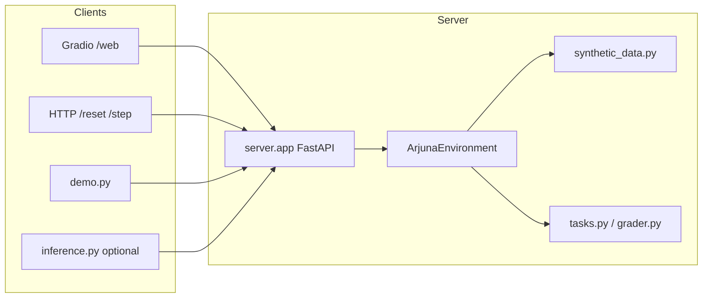

# ARJUNA Perception Environment

**Name:** Arjuna Perception Environment (`arjuna-perception-env` in OpenEnv metadata)  
**One-liner:** A simulated robot **vision / perception** environment where an agent reads YOLO-style scene descriptions and is scored on identification, triage, and low-confidence decisions—built on **OpenEnv**.

## What does this environment do?

In **2–4 lines:** ARJUNA is an autonomous robot whose “eyes” are simulated here. Each episode samples a **synthetic scene** (all data is local in `server/synthetic_data.py`). The agent receives **natural-language observations** with fake detections and must emit a structured **action**. The **grader** returns a **reward in \[0, 1\]** and **feedback** so you can train or evaluate agents with a clear objective—without real cameras, cloud databases, or (for the env itself) any external API.

---

## Submission & demo links

| Item | Link |
|------|------|
| **Hugging Face Space (project)** | [huggingface.co/spaces/Calpol500mg/arjuna-env](https://huggingface.co/spaces/Calpol500mg/arjuna-env) |
| **Live app (root)** | [https://calpol500mg-arjuna-env.hf.space](https://calpol500mg-arjuna-env.hf.space) |
| **Swagger / OpenAPI (`/docs`)** | [https://calpol500mg-arjuna-env.hf.space/docs](https://calpol500mg-arjuna-env.hf.space/docs) |
| **Interactive Playground (`/web`)** — Gradio UI | [https://calpol500mg-arjuna-env.hf.space/web](https://calpol500mg-arjuna-env.hf.space/web) |
| **Public GitHub repository** | [github.com/AyushKumar-alt/arjuna-env](https://github.com/AyushKumar-alt/arjuna-env) |

### For judges — try the environment in the browser

Use the **live Playground** (no API key required for the environment itself):

**[https://calpol500mg-arjuna-env.hf.space/web](https://calpol500mg-arjuna-env.hf.space/web)**

1. Click **Reset** and read **`task_type`** in the raw JSON.  
2. Fill only the fields that match that task (**Task1 Label** / **Ranked Objects** / **Decision** + **Reasoning**).  
3. Click **Step** once and inspect **`reward`**, **`done`**, and **`feedback`**.

The Docker image sets **`ENABLE_WEB_INTERFACE=true`** so this UI is served on **Hugging Face Spaces** after you rebuild and push the Space.

---

## Hackathon / Round 1: quick answers

| Question | Answer |
|----------|--------|
| **What does the environment do?** | Simulates ARJUNA robot **perception**: the agent reads **YOLO-style scene text** and acts with **`ArjunaAction`**; **`reset` / `step`** return rewards in **[0, 1]** using **local synthetic scenes** only. |
| **How do I run it locally?** | **`pip install -r requirements.txt`** then **`python -m uvicorn server.app:app --host 0.0.0.0 --port 7860`** (optional: **`ENABLE_WEB_INTERFACE=true`** for **`/web`**). |
| **How do I build the Docker image?** | From repo root: **`docker build -t arjuna-env .`** then **`docker run -p 7860:7860 arjuna-env`** — the image enables **`/web`** by default (`ENABLE_WEB_INTERFACE` in `Dockerfile`). |
| **How do I test the demo?** | Start the server, set **`ARJUNA_ENV_BASE_URL`** if needed, run **`python demo.py`**. Optionally **`python -m openenv.cli validate https://calpol500mg-arjuna-env.hf.space`**. |
| **Which files define environment / tasks / grader?** | **`server/arjuna_environment.py`** (env + sessions), **`server/synthetic_data.py`** (scenes), **`server/tasks.py`** & **`server/grader.py`** (rewards), **`models.py`** (actions/observations). |
| **Does it run offline?** | **Yes** for the env, **`demo.py`**, and **`/web`**: **no cloud DB**, scenes are **local**. **`inference.py`** alone needs **network + HF token** (optional baseline). |
| **What is the Hugging Face demo URL?** | **Space:** [huggingface.co/spaces/Calpol500mg/arjuna-env](https://huggingface.co/spaces/Calpol500mg/arjuna-env) — **Live:** [calpol500mg-arjuna-env.hf.space](https://calpol500mg-arjuna-env.hf.space) |

---

## Table of contents

1. [Hackathon / Round 1: quick answers](#hackathon--round-1-quick-answers)  
2. [Environment overview (observations, actions, tasks)](#environment-overview-observations-actions-tasks)  
3. [Prerequisites](#prerequisites)  
4. [Setup: `requirements.txt` and venv](#setup-requirementstxt-and-venv)  
5. [Run with Docker](#run-with-docker)  
6. [Run locally without Docker (uvicorn)](#run-locally-without-docker-uvicorn)  
7. [Run the demo (offline)](#run-the-demo-offline)  
8. [Gradio Playground (`/web`)](#gradio-playground-web)  
9. [How grading works](#how-grading-works)  
10. [OpenEnv compliance and key files](#openenv-compliance-and-key-files)  
11. [Project structure](#project-structure)  
12. [Example interaction (reset → step)](#example-interaction-reset--step)  
13. [Testing and validation](#testing-and-validation)  
14. [Offline execution](#offline-execution)  
15. [Optional: LLM baseline (`inference.py`)](#optional-llm-baseline-inferencepy)  
16. [Design notes](#design-notes)  
17. [Troubleshooting](#troubleshooting)  
18. [FAQ](#faq)  
19. [Future improvements](#future-improvements)  
20. [Screenshots / visuals](#screenshots--visuals)  
21. [Credits and acknowledgements](#credits-and-acknowledgements)  
22. [License](#license)  
23. [Maintainer / contact](#maintainer--contact)  

---

## Environment overview (observations, actions, tasks)

### What the agent sees

After **`reset`**, **`ArjunaObservation`** includes:

- **`task_type`**: `1`, `2`, or `3`
- **`scene_id`**: id into synthetic data (e.g. `t1_008`)
- **`observation_text`**: instructions + scene description + simulated YOLO lines
- **`episode_id`**: must be sent back on **stateless HTTP** `POST /step` (see below)
- After **`step`**: **`reward`**, **`done`**, **`feedback`**

Definitions live in **`models.py`**.

### What actions it can take

Single Pydantic model **`ArjunaAction`** — set fields that match the active **`task_type`**:

| Field | Task | Role |
|--------|------|------|
| **`task1_label`** | 1 | Predicted class label (string) |
| **`ranked_objects`** | 2 | Ordered list of labels (most important first) |
| **`decision`** | 3 | One of `discard`, `request_rescan`, `log_and_continue` |
| **`reasoning`** | 3 | Optional; affects partial credit on task 3 |

### The three tasks (summary)

- **Task 1 — Single-object identification:** One primary detection; agent fills **`task1_label`**. Grading uses **exact match** plus **semantic partial credit** (same broad category, etc.). See [How grading works](#how-grading-works).
- **Task 2 — Multi-object triage:** Several detections; agent fills **`ranked_objects`**. Score is **fraction of positions matching** the ground-truth order (confidence first; tie-break: person > vehicle > other).
- **Task 3 — Low-confidence decision:** One low-confidence primary detection; agent fills **`decision`** and optional **`reasoning`**. Bands: **&lt; 0.35 → discard**, **0.35–&lt;0.50 → request_rescan**, **≥ 0.50 → log_and_continue**. Grading uses **adjacent-band** partial credit and **reasoning quality** (numeric confidence in text → “strong” reasoning).

---

## Prerequisites

| Requirement | Notes |
|-------------|--------|
| **Python** | **3.11+** (matches `Dockerfile`; 3.12+ usually fine locally) |
| **pip** | For `requirements.txt` |
| **Docker** | **Docker Desktop** (or compatible engine) to build/run the image—optional if you use uvicorn only |
| **Git** | To clone / push the repo |

No cloud database, no Redis, no external service is required to **run the environment** itself.

---

## Setup: `requirements.txt` and venv

From the repository root:

```bash
python -m venv .venv
```

**Windows (PowerShell):**

```powershell
.\.venv\Scripts\Activate.ps1
pip install -r requirements.txt
```

**macOS / Linux:**

```bash
source .venv/bin/activate
pip install -r requirements.txt
```

`requirements.txt` pins **OpenEnv** (`openenv-core`), **FastAPI**, **uvicorn**, **pydantic**, and **openai** (used only by the optional **`inference.py`** baseline).

---

## Run with Docker

From the repository root:

```bash
docker build -t arjuna-env .
docker run -p 7860:7860 arjuna-env
```

Defaults (the **`Dockerfile`** sets **`ENABLE_WEB_INTERFACE=true`**):

- **Playground:** `http://127.0.0.1:7860/web`  
- **Swagger:** `http://127.0.0.1:7860/docs`  
- **Health:** `http://127.0.0.1:7860/health`

To turn the Playground **off** in a local run: **`docker run -p 7860:7860 -e ENABLE_WEB_INTERFACE=false arjuna-env`**

---

## Run locally without Docker (uvicorn)

```bash
# optional: Gradio UI at /web
export ENABLE_WEB_INTERFACE=true   # Windows PowerShell: $env:ENABLE_WEB_INTERFACE="true"

python -m uvicorn server.app:app --host 0.0.0.0 --port 7860
```

Use another port if **7860** is busy, e.g. `--port 8000`.

---

## Run the demo (offline)

The **demo does not call Hugging Face or any LLM API**. It uses a small heuristic policy and talks to your running server over HTTP.

**Terminal 1 — start the server** (Docker or uvicorn as above). Example with Docker:

```bash
docker build -t arjuna-env .
docker run -p 7860:7860 arjuna-env
```

**Terminal 2 — from repo root, with dependencies installed:**

```bash
# default base URL is http://127.0.0.1:7860
export ARJUNA_ENV_BASE_URL=http://127.0.0.1:7860   # PowerShell: $env:ARJUNA_ENV_BASE_URL="http://127.0.0.1:7860"
python demo.py
```

You will see printed observations, actions, rewards, and a short summary. **`demo.py`** is the canonical **offline-friendly** “try the env” entrypoint for reviewers.

---

## Gradio Playground (`/web`)

When **`ENABLE_WEB_INTERFACE=true`**, OpenEnv mounts a browser UI at **`/web`**.

This repo applies **`server/openenv_web_patch.py`** so the Playground **Step** passes **`episode_id`** into **`env.step`**, consistent with HTTP **`POST /step`** (important on stateless workers and HF Spaces).

**Usage:**

1. Click **Reset** — check **`task_type`** in the raw JSON.  
2. Fill **only** the fields for that task (Task 1: label; Task 2: ranking; Task 3: decision + optional reasoning).  
3. Click **Step** once per episode.

**Task 2 input:** `ranked_objects` can be a **JSON array string** (e.g. `["person","car"]`) or **comma-separated** labels; **`models.py`** coerces strings into `list[str]` for the Playground.

---

## How grading works

Plain-language summary (details in **`server/tasks.py`**; discoverable re-exports in **`server/grader.py`**):

- **Task 1:** Compares normalized **`task1_label`** to the scene’s expected label. **1.0** exact match; **0.7** same semantic **category group** (vehicles / people / animals); **0.2** agent label is a known category but wrong group; **0.0** otherwise.  
- **Task 2:** Compares your ordering to **`expected_priority`** in synthetic data: **correct_positions / n**.  
- **Task 3:** Maps detector confidence to gold action (`discard` / `request_rescan` / `log_and_continue`). **Correct + “strong” reasoning** (text mentions a numeric confidence) → **1.0**; **correct + weak/no reasoning** → **0.8**; **one band off** with strong/weak reasoning → **0.5** / **0.3**; **two bands off or invalid** → **0.0**.

Feedback strings after **`step`** are produced in **`server/arjuna_environment.py`** from these scores.

---

## OpenEnv compliance and key files

This project targets **OpenEnv** conventions:

- **HTTP:** `POST /reset`, `POST /step`, state routes as provided by **`openenv.core.env_server.create_app`**.  
- **Models:** **`ArjunaAction`**, **`ArjunaObservation`**, **`ArjunaState`** extend OpenEnv base types in **`models.py`**.  
- **Environment:** **`server/arjuna_environment.py`** — implements **`reset` / `step` / `state` / `get_metadata`**, Gymnasium-style episode flow, **`EnvironmentMetadata`** for docs.

| Concern | Primary file(s) |
|--------|------------------|
| Episodes, sessions, orchestration | `server/arjuna_environment.py` (`SESSIONS` + `episode_id` for HTTP) |
| Rubric / reward logic | `server/tasks.py`, **`server/grader.py`** (re-exports) |
| Scenes and gold labels | `server/synthetic_data.py` |
| FastAPI / OpenEnv app | `server/app.py`, **`server/openenv_web_patch.py`** (Gradio `episode_id`) |
| CLI / Space config | `openenv.yaml`, `Dockerfile` |

---

## Project structure

```
arjuna_env/
├── README.md                 # This file (HF Space frontmatter at top)
├── LICENSE                   # MIT
├── openenv.yaml              # OpenEnv / Space metadata
├── requirements.txt
├── Dockerfile
├── docs/
│   └── images/               # README screenshots (add PNG/GIF here)
├── demo.py                   # Offline-friendly heuristic demo (no LLM)
├── inference.py              # Optional LLM baseline (uses HF router + API key)
├── client.py                 # Thin HTTP client helper
├── models.py                 # ArjunaAction, ArjunaObservation, ArjunaState
├── __init__.py
└── server/
    ├── app.py                # OpenEnv FastAPI app + OpenAPI tweaks
    ├── arjuna_environment.py # Core Environment: reset / step / state
    ├── tasks.py              # Grading + prompt formatting
    ├── grader.py             # Explicit re-exports of grading functions
    ├── synthetic_data.py     # All scenes (100% local)
    ├── openenv_web_patch.py  # Gradio: pass episode_id into step
    └── __init__.py
```

---

## Example interaction (reset → step)

**1. Reset** returns `task_type`, `scene_id`, `episode_id`, `observation_text`, `reward: 0`, `done: false`.  
**2. Step** with body:

```json
{
  "episode_id": "<from reset observation>",
  "action": { "task1_label": "bicycle" }
}
```

**3. Response** includes `reward`, `done: true`, and `feedback` (for task 1: expected vs got and score).

Same pattern for task 2 (`ranked_objects` list) and task 3 (`decision` + optional `reasoning`). See also the **curl** examples under [Validate](#testing-and-validation) in older sections or use Swagger **`/docs`**.

---

## Testing and validation

**OpenEnv CLI validate** (network required; checks deployed Space):

```bash
python -m openenv.cli validate https://calpol500mg-arjuna-env.hf.space
```

**Manual smoke test (local or Space):**

1. `POST /reset` with `{"seed": 42}`  
2. Copy `observation.episode_id`  
3. `POST /step` with `episode_id` + `action` appropriate for `task_type`  
4. Expect `200`, `done: true`, `feedback` non-empty for a valid action shape

**Playground:** `Reset` → fill fields → `Step` once; expect graded JSON.

*(Automated `pytest` suite is not bundled; add `tests/` if you want CI-style checks.)*

---

## Offline execution

- **Environment, scenes, and grader:** run entirely **on your machine** (or in Docker). Data is **local** in **`server/synthetic_data.py`**. **No cloud database** and **no external HTTP** are required for **`reset` / `step` / `demo.py` / Playground**.  
- **`inference.py`** is **optional**: it calls a **remote LLM** via Hugging Face Inference / OpenAI-compatible router and is **not** needed to verify the environment or grading.

---

## Optional: LLM baseline (`inference.py`)

Uses **network + API key** (HF token). Example (**PowerShell**):

```powershell
$env:API_BASE_URL="https://router.huggingface.co/v1"
$env:MODEL_NAME="meta-llama/Llama-3.3-70B-Instruct"
$env:HF_TOKEN="your_hf_token_here"
$env:ARJUNA_ENV_BASE_URL="http://127.0.0.1:7860"
# Optional quota savers:
$env:N_SEEDS="3"
$env:MAX_TOKENS="80"
$env:ENABLE_RETRY="0"

python inference.py
```

---

## Design notes

- **Stateless HTTP:** `episode_id` + module-level **`SESSIONS`** keeps scene state across requests (critical on HF Spaces).  
- **Single action schema:** one **`ArjunaAction`** for all tasks; agents pick fields based on **`task_type`**.  
- **Synthetic diversity:** multiple scenes per task support varied rewards, not only 0/1.  
- **Playground UX:** `ranked_objects` string coercion and **`openenv_web_patch`** reduce friction for reviewers using **`/web`**.

---

## Troubleshooting

| Issue | What to try |
|--------|-------------|
| `Call reset() before step()` | Call **`/reset`** (or **Reset** in UI) before **`step`**; send **`episode_id`** on HTTP; only **one** graded **Step** per episode unless you **Reset** again. |
| `only one usage of each socket address` | Another process uses the port; pick another `--port` or `taskkill` the old listener (see `netstat` / `findstr` on Windows). |
| Docker `npipe` / cannot connect | Start **Docker Desktop** and wait until the engine is running. |
| Playground `ranked_objects` validation | Use JSON array string or comma-separated labels (see [Gradio](#gradio-playground-web)). |
| `/web` returns **404** | Start with **`ENABLE_WEB_INTERFACE=true`** **before** importing/running the app; rebuild/restart container if needed. |
| HF `402` on `inference.py` | Inference quota exhausted; use smaller **`N_SEEDS`** / **`MAX_TOKENS`** or run **`demo.py`** offline. |

---

## FAQ

**Q: Does the Space need my API key?**  
A: The **environment** does not. Only **`inference.py`** (external LLM) needs a token.

**Q: Where is the “source of truth” for correct answers?**  
A: **`server/synthetic_data.py`** (expected labels, orderings, task 3 bands).

**Q: Why is `episode_id` required on HTTP step?**  
A: Workers may be stateless; **`SESSIONS[episode_id]`** ties **reset** and **step** together.

**Q: Is WebSocket supported?**  
A: Yes via OpenEnv’s stack; **`inference.py`** can pass metadata consistently. HTTP remains the primary “curl-friendly” path.

---

## Future improvements

- Add a **`tests/`** package with parametrized grading and HTTP contract tests.  
- Optional **`gradio_builder`** “Custom” tab with task-aware field visibility.  
- Add a short **-screen recording (GIF)** of Reset → Step on **`/web`** if file size stays reasonable for the repo.

---

## Screenshots / visuals

Live UI for judges: **[https://calpol500mg-arjuna-env.hf.space/web](https://calpol500mg-arjuna-env.hf.space/web)** (see [Submission & demo links](#submission--demo-links)).

### Swagger / OpenAPI (`/docs`)


### Gradio Playground (`/web`)


Source files live in **`docs/images/`** (relative paths so GitHub and Hugging Face README rendering work).

**Architecture (high level):**



---

## Credits and acknowledgements

- **[OpenEnv](https://github.com/meta-pytorch/OpenEnv)** — Meta & Hugging Face, HTTP/WebSocket environment interface.  
- **FastAPI**, **Pydantic**, **uvicorn**, **Gradio** (via OpenEnv UI).  
- Synthetic scenes and grading authored for this **ARJUNA Perception** hackathon project.

---

## License

This project is released under the **MIT License** — see the [`LICENSE`](LICENSE) file in the repository root.

---

## Maintainer / contact

- **Author:** Ayush Kumar  
- **HF Space:** [Calpol500mg/arjuna-env](https://huggingface.co/spaces/Calpol500mg/arjuna-env)  
- **Live app:** [calpol500mg-arjuna-env.hf.space](https://calpol500mg-arjuna-env.hf.space)

For reviewer questions, use the Space **Community** tab or GitHub **Issues**: [github.com/AyushKumar-alt/arjuna-env/issues](https://github.com/AyushKumar-alt/arjuna-env/issues).

---

## Baseline results (historical, LLM-dependent)

Representative **`inference.py`** run (will vary by model and quota):

- Task 1: ~1.000  
- Task 2: ~0.78  
- Task 3: ~0.67  
- Overall: ~0.82  

Prefer **`demo.py`** or manual **Playground** checks for **deterministic** smoke tests.

---

## Legacy quick reference (cURL)

**Reset**

```bash
curl -X POST https://calpol500mg-arjuna-env.hf.space/reset \
  -H "Content-Type: application/json" \
  -d "{\"seed\": 42}"
```

**Step — Task 1** (paste `episode_id` from reset)

```bash
curl -X POST https://calpol500mg-arjuna-env.hf.space/step \
  -H "Content-Type: application/json" \
  -d "{\"episode_id\": \"<paste-from-reset>\", \"action\": {\"task1_label\": \"person\"}}"
```

**Step — Task 2**

```bash
curl -X POST https://calpol500mg-arjuna-env.hf.space/step \
  -H "Content-Type: application/json" \
  -d "{\"episode_id\": \"<paste-from-reset>\", \"action\": {\"ranked_objects\": [\"person\", \"car\", \"bicycle\"]}}"
```

**Step — Task 3**

```bash
curl -X POST https://calpol500mg-arjuna-env.hf.space/step \
  -H "Content-Type: application/json" \
  -d "{\"episode_id\": \"<paste-from-reset>\", \"action\": {\"decision\": \"discard\", \"reasoning\": \"confidence below 0.35, unsafe to log\"}}"
```

On Spaces, **always** pass **`episode_id`** on **`POST /step`** after **`POST /reset`** for stateless HTTP workers.
